# Indexer Architecture

## Requirements
- restartable process than can resume and backfill events
- no loss of events
- does not write events until N confirmations (12 confirmations is about 2 mins)
- must be able to be started up and sync up to current state
- easy to add new events to config without reprocessing entire DB
- easy to add new contracts to config without reprocessing entire DB
- can handle reorg
- can be fetched on a consistency interval: finalized / unfinalized

## Process architecture


## Resilient and Lossless Event Ingestion Architecutre
Note: the server has external configuration that will initiate a restart if it goes down. Any errors should stop the process so the server can restart and resume backfilling from last written rows.

### Pseudocode
1. on start up: currentBlock = CB, N = confirmation buffer

2. subscribe
```go
for each contract+eventName
event written to processing queue (->eventQueue) [sorted insert]
```

3. backfill
```go
for each (contract,event)
	[in batches of 100 blocks]
	query event logs from [lastIndexedBlock, CB ]
	write to processing queue (->eventQueue) [sorted insert]
```
	
4. process eventQueue [infinitely running]
```go
// queue already sorted by [block num, log index]
if eventQueue has no events, sleep 10s
if eventQueue has events:
	CB = eth.getBlock()
	event = queue.pop()
	
	if (event.block <= CB - N){
		writeEvent()
	} else {
			queue.push(event) [sorted insert]
		 sleep 10s
	} 
```


## Detecting re-orgs
	

```